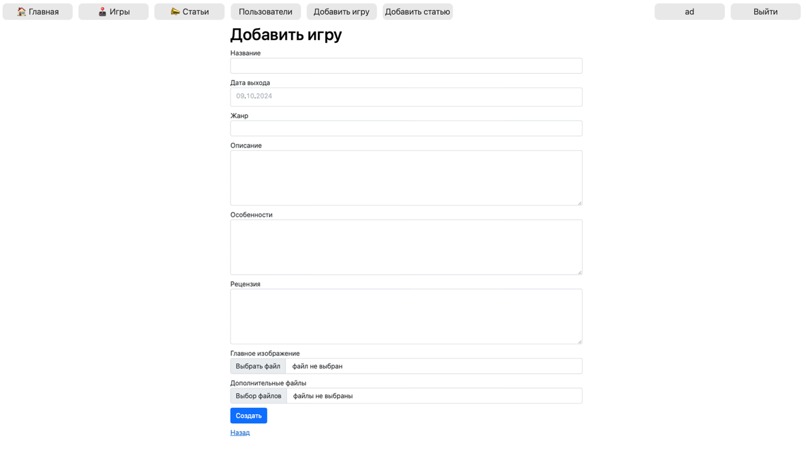
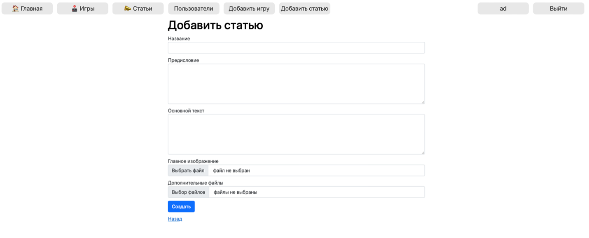
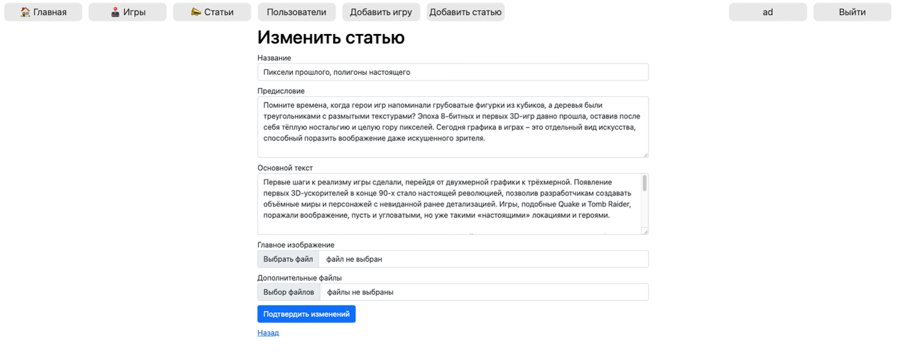

# Igrocom Web Site

## Стек
ASP.NET Core/EFCore/PostgreSQL

## Описание
Это веб-сайт, посвященный любителям компьютерных игр. Имеется возможность добавлять, редактировать, просматривать и удалять компьютерные игры, а также различные статьи. 

## Особенности 
1. Каждый пользователь может добавлять компьютерные игры или понравившиеся статьи в Избранное. Сохраненные материалы отображаются в профиле пользователя;
2. На главной странице выводятся самые популярные компьютерные игры (по количеству пользователей, добавивших их в Избранное);
3. Рейтинг каждой компьютерной игры автоматические пересчитывается при изменении оценки конкретным пользователем;
4. Администратор не может удалить статью, если она сохранена у кого-либо из пользователей.

## Скриншоты
Домашняя страница сайта


Список игр


Пример игры


Список статей


Пример статьи


Пример профиля пользователя


Окно добавления новой игры через админинстратора


Окно добавления новой статьи через админинстратора


Окно списка пользователей через админинстратора


Окно редактирования статьи через админинстратора


## Установка
1. Клонируйте репозиторий:
   ```bash
   git clone https://github.com/GitCommonUser/igrocom.git

2. Запустите все SQL-скрипты из пути SqlScripts/DB.sql

3. Установите зависимости:
   ```bash
   dotnet restore

4. Запустите проект:
   ```bash
   dotnet run

## Рекомендации
1. Пользователя с правами admin необходимо добавить вручную через SQL, так как при регистрации пользователя - ему автоматически выдается статус обычного пользователя.

2. Для хэширования паролей применяется устаревший алгоритм MD5. Для реального использования - измените на более надежный. 